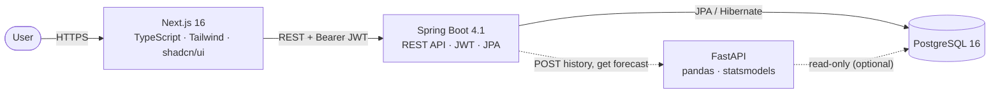
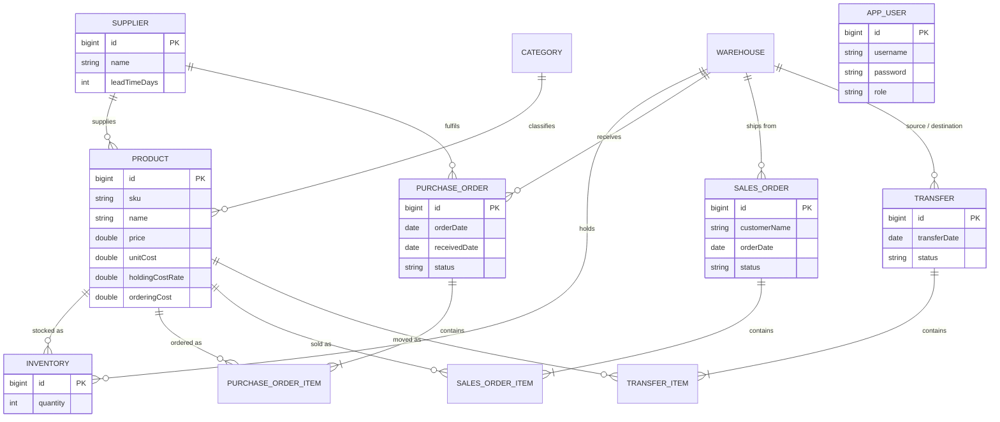

# SupplyNext

A full-stack, multi-warehouse **Smart Supply Chain Management System** — built
from scratch as a portfolio project. Not a CRUD demo: real business rules, real
auth, real analytics, real tests.

<p>
  
  
  
  
  
</p>

---

## What it does

SupplyNext manages inventory across multiple warehouses and then tells you what
to do about it.

**Operations** — products, categories, suppliers, warehouses, stock levels,
purchase orders, sales orders, and inter-warehouse transfers, with role-based
permissions on every write.

**Analytics** — EOQ, ABC classification, safety stock, reorder points, dead-stock
detection, and supplier performance scoring.

**Forecasting** — a separate Python service that fits and backtests several
time-series models, picks the most accurate one, and turns the result into a
"should I reorder, and how much?" recommendation.

---

## Architecture



Three services, one database:

| Service | Stack | Port | Responsibility |
|---|---|---|---|
| `frontend/` | Next.js 16, TypeScript, Tailwind, shadcn/ui | 3000 | UI, forms, charts |
| `backend/` | Spring Boot 4.1, Java 21, JPA, Spring Security | 8080 | Business rules, auth, persistence |
| `ml-service/` | FastAPI, Python 3.12, pandas, statsmodels | 8000 | Demand forecasting, reorder planning |

The backend is the only service that writes. The ML service is stateless by
design and reads at most — see [`ml-service/README.md`](ml-service/README.md)
for that tradeoff, stated in full.

### Backend layering

Applied consistently across all eight modules:

```
Controller  (HTTP only — no business logic)
    ↓
Service     (@Service — business rules, throws plain RuntimeException)
    ↓
Repository  (Spring Data JPA)
```

Every entity has a validated `RequestDto` and a **flattened** `ResponseDto`
(`categoryId` + `categoryName`, never a nested `category: {...}`). That was a
deliberate refactor away from returning entities directly — the old shape leaked
a `User`'s hashed password into API responses.

Business-rule violations are thrown as `RuntimeException` and caught centrally by
`GlobalExceptionHandler`, so clients get clean JSON and never a stack trace.

---

## Data model



> `APP_USER` is mapped explicitly because `user` is a reserved word in PostgreSQL.

---

## Running it

### Docker (everything at once)

```bash
cp .env.example .env
docker compose up --build
```

| | URL |
|---|---|
| Frontend | http://localhost:3000 |
| Backend API docs | http://localhost:8080/swagger-ui.html |
| ML service docs | http://localhost:8000/docs |

### Manually

<details>
<summary><b>Backend</b> — needs JDK 21 and PostgreSQL</summary>

```bash
createdb scm_db
cd backend
./mvnw spring-boot:run          # Windows: mvnw.cmd spring-boot:run
```

Connection settings live in `src/main/resources/application.properties`.
Tables are created automatically (`ddl-auto=update`).
</details>

<details>
<summary><b>Frontend</b> — needs Node 22</summary>

```bash
cd frontend
npm install
echo "NEXT_PUBLIC_API_URL=http://localhost:8080" > .env.local
npm run dev
```
</details>

<details>
<summary><b>ML service</b> — needs Python 3.12</summary>

```bash
cd ml-service
python -m venv .venv && source .venv/bin/activate
pip install -r requirements.txt
uvicorn app.main:app --reload --port 8000
```
</details>

---

## Testing

```bash
cd backend    && ./mvnw test    # 48 tests
cd ml-service && pytest -q      # 46 tests
```

**94 tests total**, none of which need a running database — the backend suite
uses in-memory H2 and the ML suite is pure Python plus stateless HTTP.

| Suite | Covers |
|---|---|
| `WarehouseIntegrationTest` | Real HTTP → Security → Controller → Service → DB, including 401 vs 403 |
| `InventoryServiceTest` | Stock adjustment, rejecting negative stock |
| `PurchaseOrderServiceTest` | Receiving, creating missing inventory records, double-receive guard |
| `SalesOrderServiceTest` | Two-pass shipping — verifies **no partial save** on insufficient stock |
| `TransferServiceTest` | Both the source decrease and destination increase |
| `DashboardServiceTest` | Aggregate KPI calculations |
| `AnalyticsServiceTest` | All seven Phase B analytics features (21 tests) |
| `test_forecasting.py` | Series construction, model selection, backtesting, guardrails |
| `test_planning.py` | Reorder point, safety stock, stockout projection |
| `test_api.py` | HTTP contract and error handling |

CI runs all three suites on every push — see
[`.github/workflows/ci.yml`](.github/workflows/ci.yml).

---

## API

Full interactive docs at `/swagger-ui.html` (backend) and `/docs` (ML service).
A ready-to-import **Postman collection** with 44 saved requests lives in
[`postman/`](postman/) — log in once and the JWT is captured automatically.

### Authentication

`POST /api/auth/register` → BCrypt-hashed, returns `{id, username, role}` — never the password.
`POST /api/auth/login` → `{token, role}`. Send it as `Authorization: Bearer <token>`.

Three roles, enforced in `SecurityConfig`:

| | ADMIN | WAREHOUSE_MANAGER | STAFF |
|---|:---:|:---:|:---:|
| Read anything | ✅ | ✅ | ✅ |
| Create warehouses / products / suppliers | ✅ | ✅ | ❌ |
| Receive POs, complete transfers, adjust stock | ✅ | ✅ | ❌ |
| Create and ship sales orders | ✅ | ✅ | ✅ |

### Core endpoints

All list endpoints are paginated with `?page=0&size=10`.

| | |
|---|---|
| `/api/warehouses`, `/api/categories`, `/api/suppliers`, `/api/products` | CRUD |
| `/api/inventory` · `PATCH /{id}/adjust` | Stock levels, relative adjustment |
| `/api/purchase-orders` · `PATCH /{id}/receive` | Increases stock, stamps `receivedDate` |
| `/api/sales-orders` · `PATCH /{id}/ship` | Two-pass validation, then decreases stock |
| `/api/transfers` · `PATCH /{id}/complete` | Moves stock between warehouses |
| `/api/dashboard/summary` | Aggregate KPIs |

### Analytics

| Endpoint | What it computes |
|---|---|
| `/api/analytics/eoq` | `√(2DS/H)` — optimal order quantity |
| `/api/analytics/abc` | A = top 80% of annual value, B = next 15%, C = rest |
| `/api/analytics/safety-stock` | `Z × σ(daily demand) × √(lead time)` |
| `/api/analytics/reorder-point` | Lead-time demand + safety stock |
| `/api/analytics/dead-stock` | Stock with no movement in N days |
| `/api/analytics/supplier-performance` | Actual lead time + on-time delivery rate |

Only **`SHIPPED`** sales orders count as demand — a pending order is a request,
not a sale, and counting it would inflate every number above.

### Forecasting

| Endpoint | |
|---|---|
| `POST /api/forecast/demand` | Forecast from supplied history (no DB needed) |
| `POST /api/forecast/reorder-plan` | Forecast + reorder recommendation |
| `GET /api/forecast/product/{id}` | Forecast straight from the database |

Five models — naive, moving average, SES, Holt, Holt-Winters — are each
backtested against a held-out tail of the history and scored by MAE, RMSE and
sMAPE. The most accurate one wins, and the API returns the whole comparison
table so the choice is auditable rather than a black box.

---

## Known tradeoffs

Tracked deliberately rather than hidden. These are the things to fix before
this is exposed anywhere real:

| | Status |
|---|---|
| JWT secret hardcoded in `JwtUtil.java` | Fine for local dev; move to an env var before deploying |
| JWT expiry set to 7 days | Dev convenience; production wants short tokens + refresh |
| Frontend stores JWT in `localStorage` | XSS-readable; httpOnly cookies are the hardening story |
| `ddl-auto=update` | Works for dev; production wants Flyway or Liquibase |
| ML service has no authentication | Keep it off the public internet, or put JWT/an API key in front |
| Forecast intervals are constant-width | Honest on average, slightly optimistic far out |

See [`TODO.md`](TODO.md) for current status and what's next.

---

## Project layout

```
SupplyNext/
├── backend/       Spring Boot API      (8 modules + auth, analytics, dashboard)
├── frontend/      Next.js UI           (11 pages, charts, protected routes)
├── ml-service/    FastAPI forecasting  (Phase C)
├── postman/       44-request API collection
├── .github/       CI pipeline
└── docker-compose.yml
```
